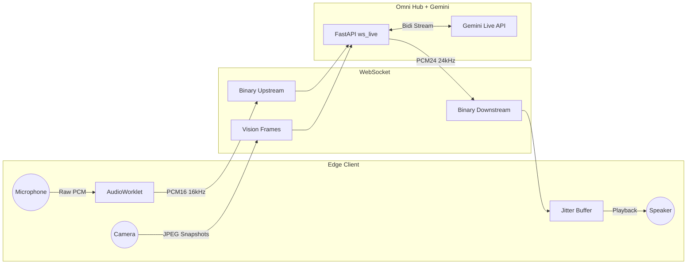
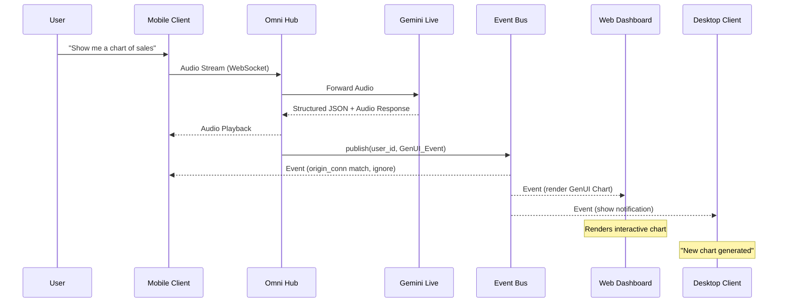
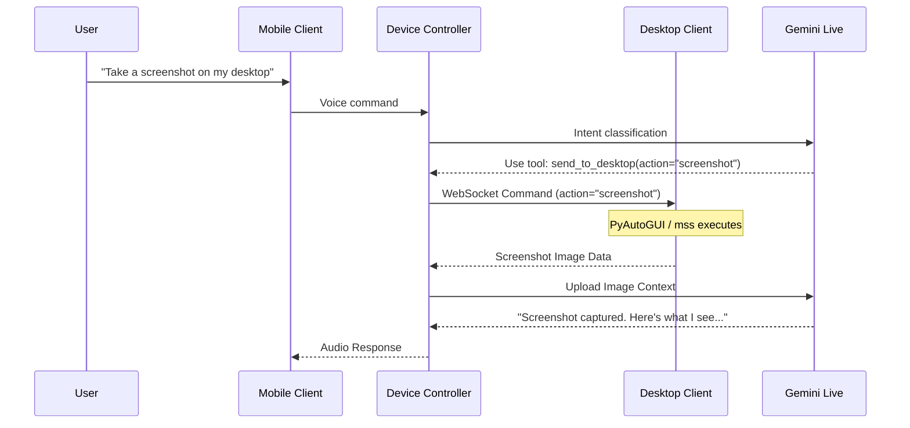
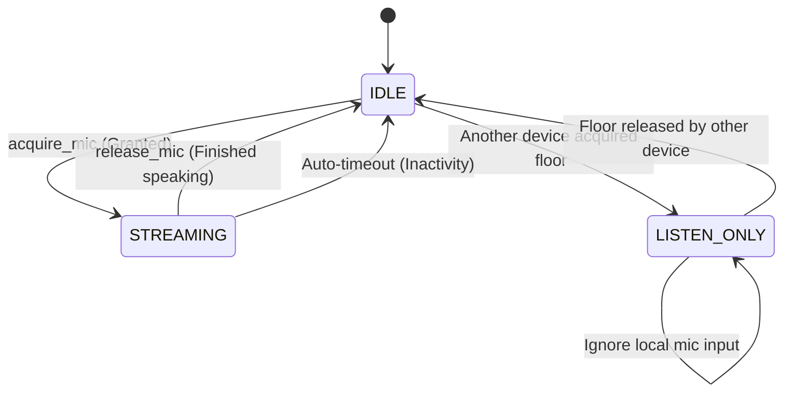
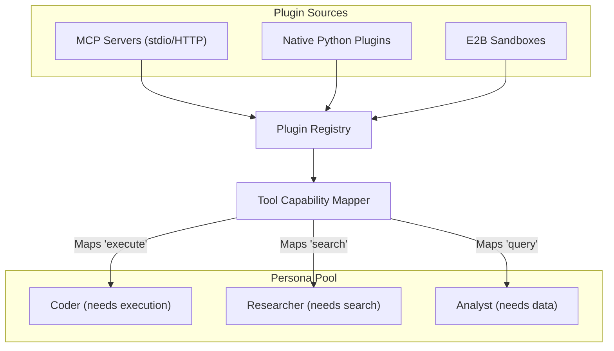
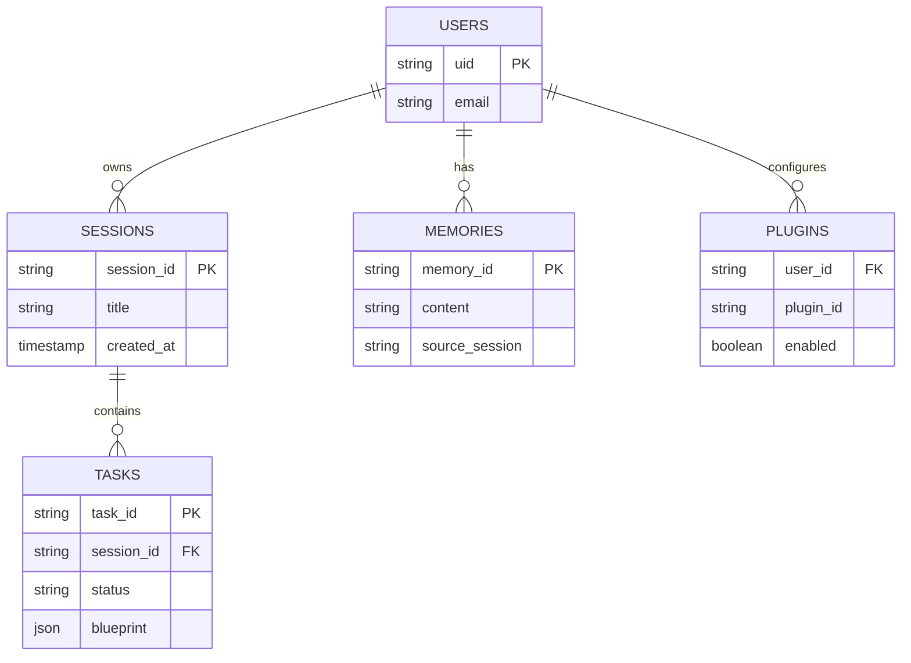
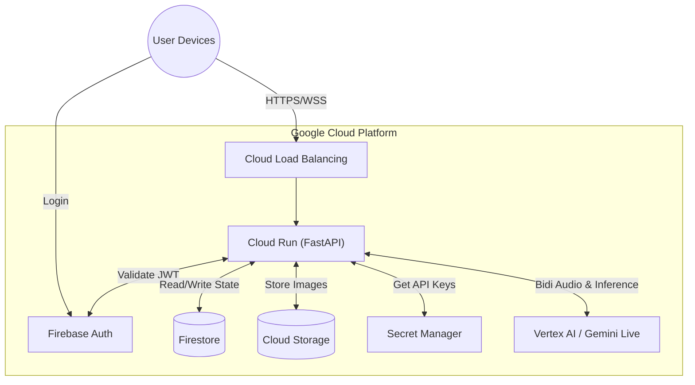
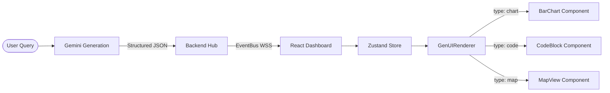

### Diagram: Agent Routing Flow
**Used In:** Blog #1
**Description:** Decision tree for message classification. Start with user message, classify intent, route to appropriate layer.
**Render at:** https://mermaid.live



---
### Diagram: Voice Pipeline
**Used In:** Blog #1
**Description:** Left-to-right audio flow from microphone to speaker. Include both upstream and downstream paths.
**Render at:** https://mermaid.live



---
### Diagram: Event Bus Fan-Out
**Used In:** Blog #1
**Description:** Sequence showing a Mobile user speaking, events processing, and fanning out to multiple devices.
**Render at:** https://mermaid.live



---
### Diagram: Cross-Device Orchestration
**Used In:** Blog #2
**Description:** Detailed sequence for "Take a screenshot on my desktop" scenario from a phone.
**Render at:** https://mermaid.live



---
### Diagram: Mic Floor State Machine
**Used In:** Blog #2
**Description:** Three states (IDLE, STREAMING, LISTEN_ONLY) with all transitions and trigger labels.
**Render at:** https://mermaid.live



---
### Diagram: Plugin System
**Used In:** Blog #1
**Description:** Show MCP Servers + Native Plugins + E2B flowing into Plugin Registry, then Tool Registry mapping to Personas.
**Render at:** https://mermaid.live



---
### Diagram: Data Model
**Used In:** Blog #1
**Description:** Firestore collections: sessions, memories, tasks, plugin_enabled_state showing relationships.
**Render at:** https://mermaid.live



---
### Diagram: Deployment Architecture
**Used In:** Blog #1
**Description:** Google Cloud services architecture showing data flow.
**Render at:** https://mermaid.live



---
### Diagram: GenUI Flow
**Used In:** Blog #1
**Description:** From user query to rendered React component via Gemini JSON structure.
**Render at:** https://mermaid.live

```mermaid
graph LR
    User([User Query]) --> Gemini[Gemini Generation]
    Gemini -->|Structured JSON| Hub[Backend Hub]
    Hub -->|EventBus WSS| React[React Dashboard]
    React --> State[Zustand Store]
    State --> Render[GenUIRenderer]

    Render -->|type: chart| Chart[BarChart Component]
    Render -->|type: code| Code[CodeBlock Component]
    Render -->|type: map| Map[MapView Component]
```
