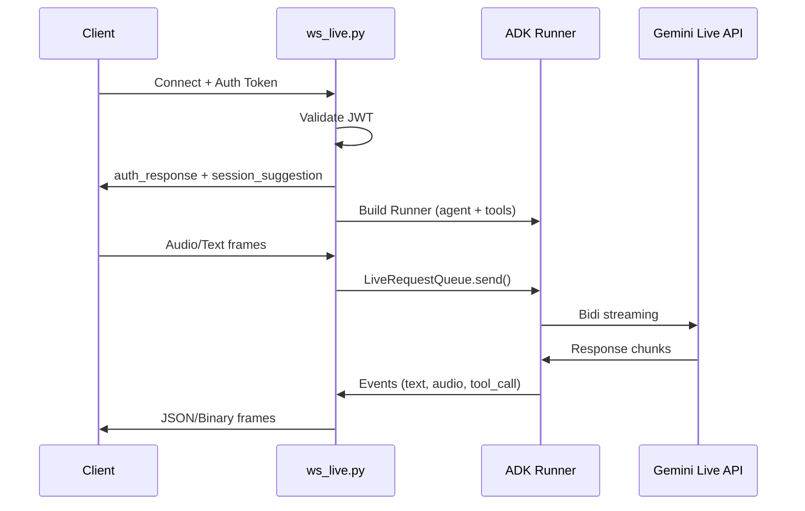

# Backend Architecture

## Stack

| Layer | Technology |
|---|---|
| Framework | FastAPI |
| Agent Runtime | Google ADK 0.5+ |
| AI Model (Live) | `gemini-live-2.5-flash-native-audio` |
| AI Model (Text) | `gemini-2.5-flash` |
| AI Model (GenUI) | `gemini-3.1-pro-preview-customtools` |
| Auth | Firebase Auth (JWT) |
| Database | Firestore |
| Sandbox (Code) | E2B Code Interpreter |
| Sandbox (Desktop) | E2B Desktop |
| Package Manager | uv |

## Directory Structure

```
backend/
├── app/
│   ├── main.py              # FastAPI app, lifespan, middleware
│   ├── config.py             # Pydantic settings
│   ├── agents/               # ADK agent definitions
│   │   ├── personas.py       # Default persona configs
│   │   └── agent_factory.py  # Dynamic agent creation
│   ├── api/                  # HTTP + WebSocket routes
│   │   ├── ws_live.py        # Bidi streaming WebSocket
│   │   ├── personas.py       # Persona CRUD
│   │   ├── plugins.py        # Plugin management
│   │   ├── sessions.py       # Session history
│   │   └── tasks.py          # File upload, desktop tasks
│   ├── mcps/                 # MCP server manifests (JSON)
│   ├── middleware/            # Auth, CORS, agent callbacks
│   ├── models/               # Pydantic data models
│   ├── plugins/              # Native plugin implementations
│   ├── services/             # Business logic services
│   │   ├── e2b_service.py    # Code execution sandbox
│   │   ├── e2b_desktop_service.py  # Virtual desktop sandbox
│   │   ├── plugin_registry.py     # MCP plugin management
│   │   └── tool_registry.py       # T1+T2+T3 tool assembly
│   ├── tools/                # T1 built-in tools
│   └── utils/                # Logging, helpers
└── tests/                    # pytest test suite
```

## WebSocket Lifecycle


