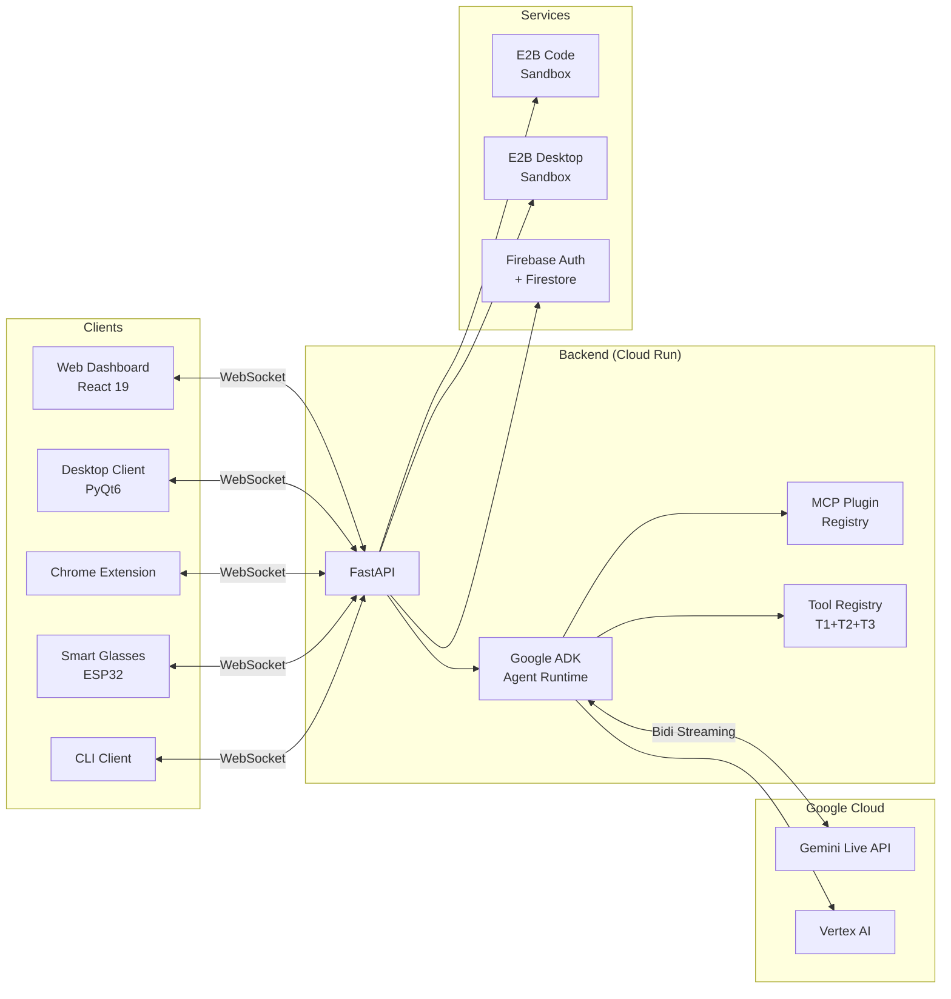
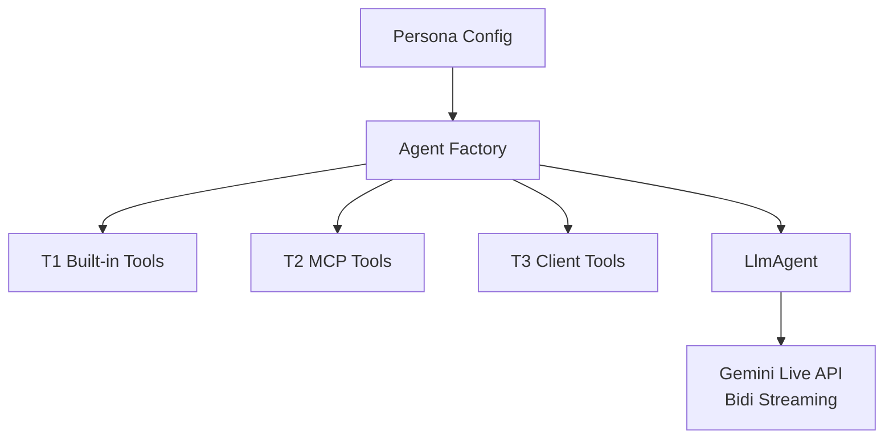

# Architecture Overview

Omni follows a **hub-and-spoke architecture** where a single FastAPI backend acts as the central brain, connecting multiple client types to Google's Gemini Live API through the Google ADK agent framework.

## High-Level Architecture

## Tool Tiers

Omni uses a three-tier tool system:

| Tier | Name | Description | Examples |
|---|---|---|---|
| **T1** | Built-in | Compiled into the agent at startup | Search, code exec, image gen, desktop tools |
| **T2** | MCP Plugins | Loaded from MCP servers (STDIO/HTTP/OAuth) | Brave Search, Google Maps, Zapier |
| **T3** | Client Tools | Provided by connected clients (reverse-RPC) | Screen capture, mouse/keyboard, file access |

## Agent System

Agents are built dynamically based on **persona** configuration:

## Component Details

- [Backend Architecture](backend.md)
- [Dashboard Architecture](dashboard.md)
- [Desktop Client Architecture](desktop-client.md)
- [Chrome Extension Architecture](chrome-extension.md)
